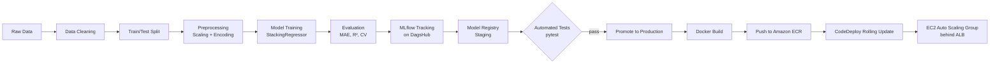

# 🛵 Food Delivery Time Prediction

An end-to-end regression system that predicts food delivery time (in minutes) for a Swiggy/Zomato-style
platform — from raw, messy data all the way to a live, load-balanced API running on AWS, with a fully
automated CI/CD pipeline.

---

## 📌 Problem Statement

Food delivery platforms have three key stakeholders — **customers**, **riders**, and **restaurants** — and
accurate ETA prediction benefits all three: it improves customer trust and reduces cancellations, helps
riders plan routes and maximize earnings, and lets restaurants prioritize order prep and staffing.

This project builds a regression model that predicts delivery time using rider attributes (age, rating,
vehicle type/condition), order context (weather, traffic, festival, time of day), and location data
(restaurant and delivery-point coordinates).

**Target variable:** `time_taken` (minutes)
**Primary metric:** MAE — chosen over RMSE because it's robust to the outlier-heavy delivery times caused
by extreme weather/traffic/holiday conditions in the data.

---

## 🗂️ Dataset

- ~45,600 rows × 20 columns
- Features: rider ID/age/rating, restaurant & delivery lat-long, order date/time, pickup time, weather
  condition, road traffic density, vehicle condition, order type, vehicle type, multiple-deliveries flag,
  festival flag, city type
- Real-world messiness handled during cleaning: city names embedded in rider IDs, invalid (negative/zero)
  lat-long values, inconsistent whitespace/casing in categorical columns, target column stored as a string
  with a `(min)` suffix, and **MNAR (Missing Not At Random)** missingness — confirmed via `missingno`
  correlation analysis, where rider-related columns (age, rating, order time) go missing together.

---

## 🏗️ Pipeline Architecture



Every stage is version-controlled and reproducible via **DVC**, and the whole flow — from a code push to a
live rolling deployment — runs automatically through **GitHub Actions**.

---

## 🔬 Approach

### 1. Data Cleaning
- Extracted city codes embedded in rider IDs, fixed invalid lat/long (negatives → absolute value, zeros →
  `NaN` for later imputation), stripped whitespace/casing issues in categorical columns, parsed the target
  column into a clean integer.
- Built as reusable, testable functions (`data_clean_utils.py`) so the same logic runs identically in
  notebooks, the DVC pipeline, and the production API.

### 2. Feature Engineering
- **Haversine distance** between restaurant and delivery location (binned into short/medium/long/very-long).
- **Pickup time** = `order_picked_time - order_time` (rider responsiveness proxy).
- **Time-of-day** buckets (morning/afternoon/evening/night) via `pd.cut`.
- Date features: day of week, is-weekend, month.

### 3. Exploratory Data Analysis
- Missingness analysis (`missingno` matrix + correlation heatmap) confirmed MNAR patterns.
- Hypothesis testing — ANOVA (numeric vs. categorical), Chi-square (categorical vs. categorical),
  Jarque-Bera (target normality) — to formally validate feature-target relationships.
- **Strong predictors identified:** traffic density, festival, multiple deliveries, distance, time of day,
  city type.
- **Weak/no relationship:** rider age, order type, weekend flag.

### 4. Missing Value Strategy
- Compared dropping MNAR rows vs. imputing (mode / constant-category for nominal features, KNNImputer for
  numeric features) — **dropping performed better** (test R² ~82.7% vs. ~80%) since the missingness itself
  carries no exploitable signal here. Final pipeline drops rows with missing values.

### 5. Model Selection & Tuning
- Benchmarked 6 regressors — Random Forest, Gradient Boosting, KNN, SVR, XGBoost, LightGBM — via **Optuna**
  Bayesian optimization (define-by-run API), tracked with MLflow.
- **LightGBM** and **Random Forest** emerged as the top two; each was individually hyperparameter-tuned
  (50 and 20 trials respectively).
- Built a **StackingRegressor**: LightGBM + Random Forest as base learners, with the meta-estimator itself
  selected via Optuna among Linear Regression / KNN / Decision Tree — **Linear Regression** won (low
  variance, best average CV score).

### 6. Final Model Performance
| Metric | Train | Test |
|---|---|---|
| MAE | ~1.2 min | **~3 min** |
| R² | ~89% | **~83–84%** |

---

## ⚙️ MLOps Stack

| Concern | Tool |
|---|---|
| Data & model versioning | **DVC** (remote: AWS S3) |
| Experiment tracking | **MLflow** (hosted on **DagsHub**) |
| Model registry & staging | **MLflow Model Registry** (Staging → Production) |
| Hyperparameter search | **Optuna** |
| API serving | **FastAPI** + **Pydantic** (input validation) |
| Testing | **pytest** (model-loading test, MAE-threshold performance test) |
| Containerization | **Docker** |
| CI/CD | **GitHub Actions** |
| Container registry | **Amazon ECR** |
| Compute | **AWS EC2 Auto Scaling Group** + **Application Load Balancer** |
| Deployment strategy | **AWS CodeDeploy** — in-place, rolling (one instance at a time) |

### DVC Pipeline (`dvc.yaml`)
```
data_cleaning → data_preparation → data_preprocessing → train → evaluate
```
Each stage declares explicit dependencies/outputs, so `dvc repro` only re-runs what's changed — model
hyperparameters live in `params.yaml`.

### CI/CD Workflow (`.github/workflows/cicd.yaml`)
**CI (on every push):**
1. Checkout code → set up Python + cached pip install
2. Authenticate to AWS → `dvc pull` (latest data/model artifacts from S3)
3. Authenticate to DagsHub (MLflow tracking)
4. Run `pytest`: model-registry load test + performance-threshold test
5. If tests pass → promote model from **Staging** to **Production** in the MLflow registry

**CD (on CI success):**
6. Log in to Amazon ECR → build Docker image → push with `latest` tag
7. Zip deployment scripts (`appspec.yml` + hooks) → upload to S3
8. Trigger **AWS CodeDeploy** → rolling update across the Auto Scaling Group (behind the ALB, zero downtime)

---

## 🌐 API

Built with **FastAPI** for its async performance (Uvicorn server) and **Pydantic** for automatic request
validation/type coercion.

| Endpoint | Method | Purpose |
|---|---|---|
| `/` | GET | Health check (also used by the ALB) |
| `/predict` | POST | Takes raw order/rider/weather features → returns predicted delivery time (minutes) |
| `/docs` | GET | Interactive Swagger UI |

The API loads the **raw** input schema, runs it through the same cleaning + feature engineering pipeline
used in training, then through the saved `ColumnTransformer` preprocessor and the stacking model — all
pulled from the MLflow Model Registry's **Production** stage.

---

## 🐳 Containerization & Deployment

- **Base image:** `python:3.12-slim` (+ `libgomp1` for LightGBM's OpenMP dependency)
- Layered so dependency installs are cached separately from application code — rebuilds are fast when only
  code/model artifacts change
- Deployed onto an **EC2 Auto Scaling Group** (min: 1, desired: 2, max: 3) behind an **Application Load
  Balancer**, using **CodeDeploy** for rolling, zero-downtime updates
- IAM roles scoped per component: EC2 instances get read-only ECR/S3 access + CodeDeploy connectivity; the
  CodeDeploy service role gets S3, ASG, and load-balancer permissions

---

## 📁 Project Structure

```
food-delivery-time-prediction/
├── data/
│   ├── raw/                    # original data (DVC-tracked)
│   ├── interim/                # train/test split
│   └── processed/              # scaled & encoded features
├── src/
│   ├── data/
│   │   ├── data_cleaning.py
│   │   └── data_preparation.py
│   ├── features/
│   │   └── data_preprocessing.py
│   └── models/
│       ├── train.py
│       ├── evaluate.py
│       └── register_model.py
├── models/                     # preprocessor.joblib, model.joblib (DVC-tracked)
├── notebooks/                  # EDA & experimentation notebooks
├── scripts/
│   ├── data_clean_utils.py     # shared cleaning logic (notebooks + pipeline + API)
│   ├── promote_model.py        # Staging → Production promotion
│   └── sample_predictions.py   # hits the live API with a random row
├── deploy/
│   └── scripts/
│       ├── install_dependency.sh
│       └── start_docker.sh
├── tests/
│   ├── test_model_registry.py
│   └── test_model_performance.py
├── .github/workflows/cicd.yaml
├── appspec.yml                 # CodeDeploy hooks
├── app.py                      # FastAPI service
├── Dockerfile
├── dvc.yaml
├── params.yaml
├── requirements.txt            # dev/pipeline deps
└── requirements-docker.txt     # runtime-only deps
```

---

## 🚀 Running Locally

```bash
# 1. Clone and set up environment
git clone <repo-url>
cd food-delivery-time-prediction
python -m venv .venv && source .venv/bin/activate
pip install -r requirements.txt

# 2. Pull versioned data & model artifacts
dvc pull

# 3. Reproduce the full training pipeline
dvc repro

# 4. Run the API locally
python app.py
# → visit http://localhost:8000/docs for Swagger UI
```

## 🧪 Running Tests

```bash
pytest tests/
```

---

## 🔭 Future Work

- **Model retraining** pipeline once more historical data (currently ~2 months) is available
- **Model monitoring** — drift detection on incoming prediction distributions
- **Blue-green deployment** as an alternative to rolling updates once retraining is automated
- Docker image size optimization (currently ~555 MB compressed)

---

## 🛠️ Tech Stack Summary

`Python` · `Pandas` · `Scikit-learn` · `LightGBM` · `Optuna` · `MLflow` · `DagsHub` · `DVC` · `FastAPI` ·
`Pydantic` · `pytest` · `Docker` · `AWS (S3, ECR, EC2, ALB, CodeDeploy, Auto Scaling)` · `GitHub Actions`

---

## 👤 Author

**Priyanshu Sahu**
